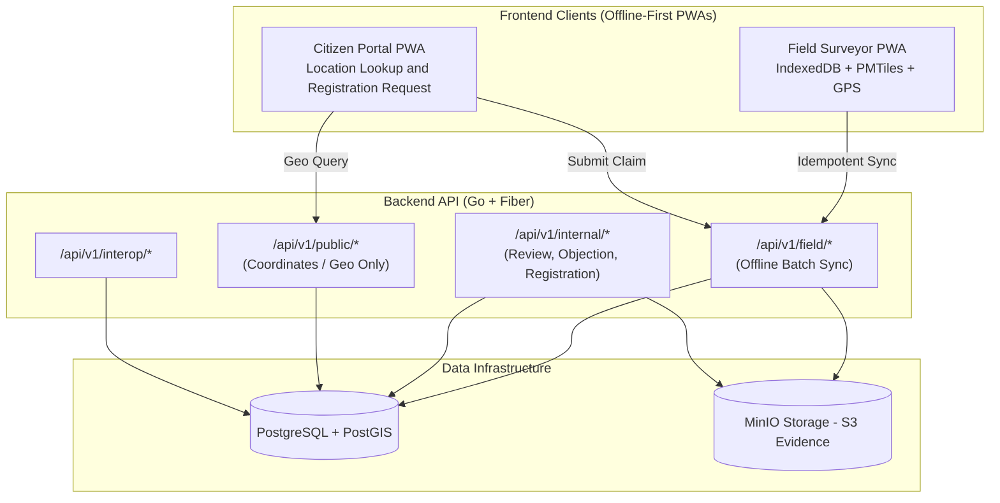
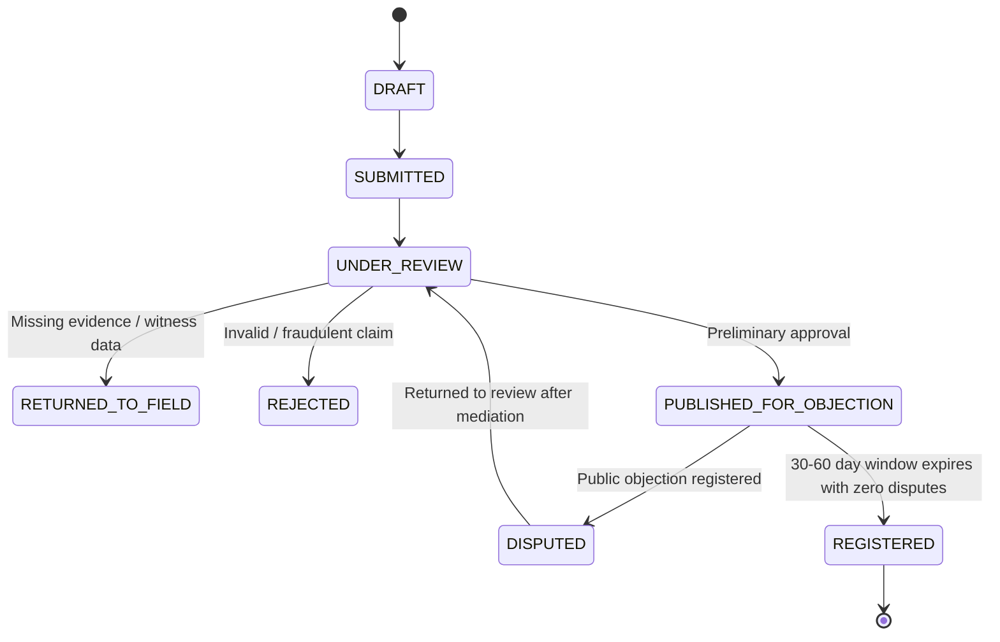

# Open Land Registry (`open-land-registry` / Bornage)

**`open-land-registry`** is an open source, **Fit-for-Purpose (FFP)** cadastral and land registration engine

---

## Technical Architecture

---

## 🔄 Claim State Machine

